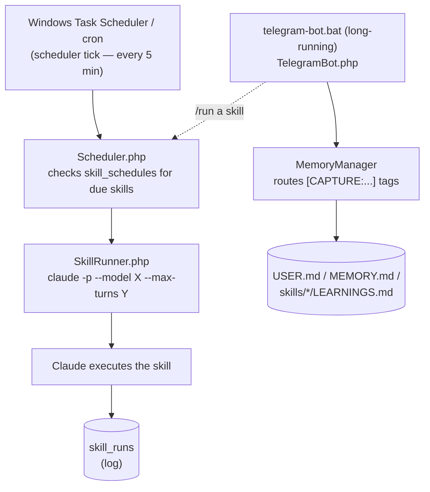

# AgentCore

Scheduled Claude Code agents — markdown skills dispatched from cron, Telegram control with a durable-rule capture protocol, and a small web UI for management.

The same workspace runs my daily automations (briefings, news digests, end-of-day cleanups, reminders) and a multi-skill product-analysis pipeline for an entertainment app I operate. Skill runs shell out to the `claude -p` CLI so the Claude Code subscription does the work.

## What it does

- **Scheduled skills** — Each skill is a markdown file. AgentCore runs them on cron schedules with configurable models and turn caps. One OS-level cron tick (every 5 minutes) fans out to N skill schedules in the database — adding a new skill never touches the OS scheduler.
- **Telegram bot** — Control the system from a phone. Run skills, check status, or have free-form conversations whose facts get captured into the right memory file via a `[CAPTURE:target]` protocol (see below).
- **Web UI** — View and edit skills, manage schedules, browse run history. LAN-only by default; optional shared-token auth for remote access.
- **Three-tier memory** — Daily `STATUS.md` (today), long-term `MEMORY.md` (system-wide rules, weekly-pruned), per-skill `LEARNINGS.md` (operational knowledge, weekly-curated). Per-skill learnings load only with their own skill, not globally.
- **Token discipline** — Each skill run is a fresh `claude -p` session with a per-skill model selection and a hard `--max-turns` cap.

## Framework / workspace split

```
+-- AgentCore checkout (this repo) --------+    +-- Your workspace --------------+
|  src/      PHP framework                 |    |  USER.md  SOUL.md  MEMORY.md   |
|  config/   defaults + your config.local  |--->|  TOOLS.md STATUS.md            |
|  web/      skills manager UI             |    |  TELEGRAM_INSTRUCTIONS.md      |
|  scripts/  scheduler.bat / telegram.bat  |    |  .env  (workspace credentials) |
|  templates/workspace/  starter skeleton  |    |  skills/<name>/SKILL.md        |
+------------------------------------------+    |  memory/  (daily archive)      |
                                                +--------------------------------+
```

Framework code is generic; everything personal — voice, facts, the people in your life, operational rules, scheduled skills — lives in the workspace. The init script seeds a new workspace from `templates/workspace/`. Multiple workspaces can share one AgentCore checkout.

## The capture protocol

The Telegram bot's job isn't only to answer — it's to **capture rules and facts so they persist beyond the conversation and shape how scheduled skills behave tomorrow**. The bot does this by wrapping durable statements in tags inside its own reply.

What Claude writes:

```
Got it. [CAPTURE:user] Jordan is my partner — never include in business
contact suggestions. [/CAPTURE]
```

What you see in Telegram:

```
Got it.
```

What gets appended to `USER.md`:

```
- **2026-05-13 14:22:01** — Jordan is my partner — never include in business contact suggestions.
```

Targets: `[CAPTURE:user]` → `USER.md`, `[CAPTURE:memory]` → `MEMORY.md`, `[CAPTURE:skill:<name>]` → `skills/<name>/LEARNINGS.md`. `MemoryManager` parses the tags, routes each body to the right file with a timestamp, and strips the blocks from the user-visible reply.

Making the reply itself the durable-rule channel — rather than asking the model to call a `save_rule()` tool — keeps the reflex harder to skip under prompt noise and easier to debug, because the captured payload sits right in the bot's own output and lands in a file you can grep.

## Architecture



A few non-obvious pieces:

- **Single combined system prompt.** `SkillRunner` assembles `SOUL.md` + `SKILL.md` + `MEMORY.md` + per-skill `LEARNINGS.md` into one file and passes it via a single `--append-system-prompt-file`. Passing multiple `--append-system-prompt-file` flags silently keeps only the last one — including dropping the skill instructions themselves.
- **Hot-reload for the long-running bot.** `TelegramBot` snapshots source-file mtimes at startup and exits cleanly when any of them changes; the `.bat` / `.sh` wrapper loop restarts PHP and picks up the new code. No manual restart on every edit.
- **Self-healing sessions.** Free-text Telegram conversations resume the previous `claude -p` session. If the CLI reports the session is gone (expired / renamed / invalid), the bot expires the row and falls through to a fresh session in the same request instead of wedging the user.

## Operational schedules

These run in my workspace today:

| Skill | Schedule | Model | Job |
|-------|----------|-------|-----|
| `daily-brief` | 8am daily | sonnet | Morning briefing — what happened overnight, what's on deck |
| `news-research` | 7am daily | sonnet | Curated industry/AI news digest |
| `end-of-day-synthesis` | 11:55pm daily | haiku | Archive `STATUS.md`, reset for tomorrow, surface anything missed |
| `weekly-synthesis` | Mon 12:05am | haiku | Prune `MEMORY.md` to keep the prompt cost bounded |
| `prune-learnings` | Sun 8am | haiku | Dedupe and age-out per-skill `LEARNINGS.md` files |
| `heartbeat` | Hourly 7am-10pm | haiku | Smoke test — proves the scheduler tick is alive |

The same workspace also runs a product-analysis pipeline for an entertainment app — scheduled skills monitor the database for errors and data issues, study competitive moves, propose new features and fixes, and surface engagement ideas. Each writes recommendations to a CRM where I review, approve (which creates a task), dismiss with a note, or skip.

## Requirements

- PHP 8.1+
- MySQL 8.0+ (or compatible)
- [Claude Code CLI](https://docs.anthropic.com/en/docs/claude-code) and an active Anthropic subscription (every skill run shells out to `claude -p`)
- Windows (Task Scheduler) or Linux/macOS (cron)

## Install

```bash
git clone https://github.com/rfrench2k/agentCore.git
cd agentCore

# Seed a workspace from templates/workspace/ (skips files that already exist):
./scripts/init-workspace.sh /path/to/your/workspace     # Linux/macOS
scripts\init-workspace.bat C:\path\to\your\workspace    # Windows

# Configure AgentCore (DB creds + workspace path):
cp config/config.local.php.example config/config.local.php

# Create the agentcore MySQL database, then:
php migrations/migrate.php

# Point the scheduler scripts at the workspace:
cp scripts/.agentcore.env.example scripts/.agentcore.env
```

Fill in the workspace files at the top of the new directory — `USER.md`, `SOUL.md`, `MEMORY.md`, `TOOLS.md`, `TELEGRAM_INSTRUCTIONS.md`, `.env` — then install the recurring task:

```cmd
scripts\install-tasks.bat              :: Windows (elevated cmd)
```

```cron
*/5 * * * * /path/to/agentCore/scripts/scheduler.sh   # Linux/macOS
```

Run the bot under systemd / tmux / a service wrapper via `scripts/telegram-bot.sh` (Linux/macOS) or the registered `AgentCore Telegram` task (Windows). Add a schedule from the web UI at `http://localhost/agentcore/web/skills.php` or insert one directly:

```sql
INSERT INTO skill_schedules (skill_name, cron_expression, model)
VALUES ('hello-world', '0 9 * * *', 'haiku');
```

## Skill format

Skills are directories under `<workspace>/skills/`, each containing a `SKILL.md` with YAML frontmatter:

```markdown
---
name: my-skill
description: What this skill does (shown in /list and the web UI)
allowed-tools: [Bash, Read, WebSearch]
effort: high
---

# My Skill

Instructions for Claude go here.
```

An optional `LEARNINGS.md` next to `SKILL.md` accumulates operational knowledge across runs. The Telegram bot can append to it via `[CAPTURE:skill:<name>]` tags.

## Security model

1. **Skills and Telegram conversations run with `--dangerously-skip-permissions`.** Every scheduled skill — and every free-text Telegram exchange — invokes `claude -p` with permission prompts disabled. `SKILL.md` and `TELEGRAM_INSTRUCTIONS.md` are therefore privileged files. Lock down filesystem access to the workspace and don't drop in skills you haven't read.
2. **Web UI is gated by `config.web.auth_mode`:**
   - **`local`** (default) — `REMOTE_ADDR` must be in `127.0.0.1`, `::1`, `192.168.*`, `10.*`, or `172.16-31.*`. Only safe when the web server is **not** behind a reverse proxy (proxies make `REMOTE_ADDR` always look local).
   - **`token`** — Require `?token=<secret>`, an `X-AgentCore-Token` header, or `Authorization: Bearer <secret>`. Set `config.web.token` to a long random string.
   - **`open`** — No auth. Only safe behind your own auth layer (HTTP basic, OAuth proxy, VPN-only). Never expose `open` directly to the internet.
3. **Telegram bot** allowlists chat IDs via `telegram.allowed_chat_ids`. Anyone not in the list gets ignored.
4. **Skill names** that flow into filesystem paths are validated as `[a-z0-9][a-z0-9_-]*` at the API boundary (`$validSkillName` in `web/skills-api.php`) and again at the capture-routing boundary in `MemoryManager::captureToTarget`. New endpoints should reuse the helper rather than re-validating ad-hoc.

## Cost / token logging

AgentCore can write per-run cost and token counts to a `usage_log` table in another database after every scheduled or telegram-triggered skill run. Disabled by default. See [docs/usage_log.md](docs/usage_log.md) for the schema and configuration.

## Project structure

```
agentCore/
├── config/                  Configuration system (defaults + your config.local.php)
├── src/                     Core PHP classes
│   ├── AgentCore.php        Config, DB, path resolution
│   ├── Scheduler.php        Checks due skills, runs them, logs to DB
│   ├── SkillRunner.php      Invokes claude -p with the assembled prompt
│   ├── CronExpression.php   Lightweight cron parser
│   ├── TelegramBot.php      Long-polling Telegram bot
│   ├── TelegramApi.php      Telegram API wrapper
│   ├── MemoryManager.php    STATUS/MEMORY/captures management
│   └── Logger.php           File-based logging
├── web/                     Skills manager web UI (auth-gated)
├── migrations/              Database schema
├── scripts/                 OS-level wrappers (.bat/.sh + init-workspace)
├── templates/
│   ├── workspace/           Starter skeleton copied into a new workspace by init-workspace
│   └── skills/              Bundled skills (orchestrator, weekly-synthesis, prune-learnings)
└── docs/
```

---

Ross French. MIT licensed — see [LICENSE](LICENSE).
